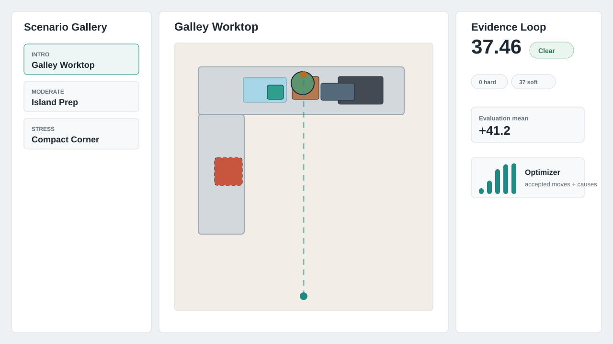

# Auto Layout / Auto Propping Optimizer Lab

[](https://github.com/Javen99/Interactive-Furniture-Layout/actions/workflows/pages.yml)
[](https://javen99.github.io/Interactive-Furniture-Layout/)

A standalone Web/TypeScript prototype for experimenting with automatic kitchen worktop prop placement. It uses synthetic room plans, primitive object shapes, and a small cost model inspired by public interior-layout research.

Live demo: <https://javen99.github.io/Interactive-Furniture-Layout/>

Suggested repository description: `Interactive TypeScript lab for automatic kitchen worktop prop placement using public interior-layout research ideas.`

Suggested topics: `interior-design`, `layout-optimization`, `typescript`, `react`, `vite`, `simulated-annealing`, `computational-design`, `furniture-layout`.



## Research Basis

This project is inspired by public SIGGRAPH 2011 papers:

- Paul Merrell, Eric Schkufza, Zeyang Li, Maneesh Agrawala, Vladlen Koltun, "Interactive Furniture Layout Using Interior Design Guidelines." The paper formulates interior layout as weighted design-guideline costs and explores alternatives with stochastic sampling while respecting user constraints.
- Lap-Fai Yu et al., "Make It Home: Automatic Optimization of Furniture Arrangement." The companion direction adds automatic optimization terms for accessibility, visibility, pathways, walls, and object relationships.

The implementation here is deliberately hobby-sized. It does not use proprietary work repositories, product catalogs, work assets, measured customer rooms, or private naming conventions.

## Paper-To-Prototype Mapping

- Design guideline costs become weighted TypeScript score terms.
- User constraints become pinned props and fixed fixtures.
- Stochastic layout search becomes a deterministic seeded simulated-annealing loop.
- Paper-style alternatives become ranked suggestions with per-term breakdowns.
- Evaluation is kept lightweight: synthetic scenarios, repeated seeds, score deltas, hard-violation counts, accessibility/pathway penalties, and optimizer diagnostics.

## MVP

- 2D top-down SVG editor for synthetic kitchen worktop layouts.
- Scene JSON model for room bounds, surfaces, fixtures, view/focal points, and movable props.
- Drag, rotate, pin, import, and export controls.
- Seeded simulated-annealing optimizer with ranked suggestions.
- Score breakdown for bounds, collisions, pinned movement, clearance, proximity, surface fit, alignment, balance, and visibility.
- Scenario gallery with repeated-seed benchmark summaries.
- Optimizer diagnostics for accepted/rejected moves, score history, and rejected cost causes.
- Access-zone and pathway primitives for keeping fixture approaches and worktop fronts usable.
- Exportable benchmark reports for sharing scenario evidence.
- Blind A/B review mode for quick human preference checks without visible scores.
- Unit tests for geometry, scoring, and optimizer repeatability.

## Tech Stack

- Vite
- React
- TypeScript
- Vitest
- lucide-react icons

## Run

```bash
npm install
npm run dev
```

PowerShell on this machine may block `npm.ps1`. Use `npm.cmd` instead:

```powershell
npm.cmd install
npm.cmd run dev
```

## Test

```bash
npm test
npm run build
```

## Deploy

GitHub Pages is configured through `.github/workflows/pages.yml`.

1. In GitHub, open repository settings.
2. Under Pages, set the source to GitHub Actions.
3. Push to `main` or run the workflow manually.
4. Open <https://javen99.github.io/Interactive-Furniture-Layout/>.

## Project Shape

- `src/domain/types.ts`: public scene model and optimizer types.
- `src/domain/geometry.ts`: oriented rectangle math, containment, overlap, and placement helpers.
- `src/domain/scoring.ts`: weighted guideline terms.
- `src/domain/optimizer.ts`: deterministic stochastic search.
- `src/domain/evaluation.ts`: repeated-seed benchmark summaries and per-term deltas.
- `src/domain/types.ts`: public scene JSON types, including optional access zones and pathways.
- `src/domain/presets.ts`: synthetic public-safe example scenes.
- `src/components`: interactive lab UI.

## Evaluation Ideas

- Compare starting scores with optimized scores across fixed benchmark seeds.
- Track hard violations separately from soft design costs.
- Track access/pathway penalties separately from collision and fixture clearance.
- Review top-ranked suggestions visually with the score panel hidden.
- Add more synthetic scenarios when a new cost term is introduced.

## Roadmap

- Add a Web Worker only if benchmark runs become visibly blocking.
- Add richer pathway routing and surface-slot generation before attempting whole-room furniture layout.
- Keep Unity/C# as a later port target once this TypeScript version is a stable reference.
